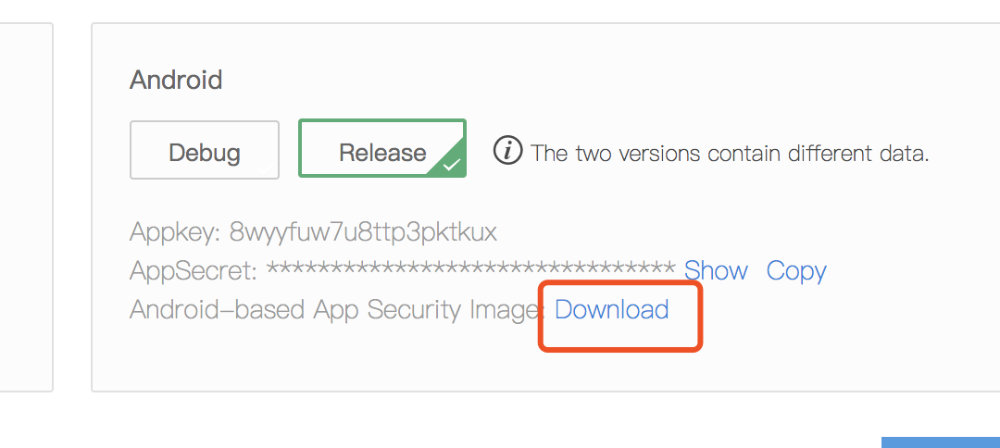
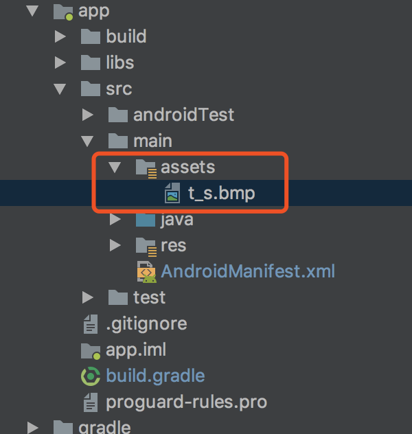

# Integrate SDK

# Preparation for Integration

### Create Project

Build your project in the Android Studio.

### Configure the build.gradle

Add the following codes to the build.gradle file.

```groovy
defaultConfig {
    ndk {
        abiFilters "armeabi-v7a"
    }
   }
    dependencies {
        implementation 'com.alibaba:fastjson:1.1.67.android'
        implementation 'com.squareup.okhttp3:okhttp-urlconnection:3.12.3'
        implementation 'org.eclipse.paho:org.eclipse.paho.client.mqttv3:1.2.0'
        implementation 'com.tuya.smart:tuyasmart:3.13.0'
    }
    
repositories {
    mavenLocal()
    jcenter()
    google()
}

```


> **[info] Note**
>
> * The Tuya Smart sdk solely supports the platform of armeabi-v7a architecture by default. Developer may refer to the [GitHub](https://github.com/TuyaInc/tuyasmart_home_android_sdk/tree/master/so_libs) if you need other platforms. 
> * After version 3.11.0, the so libraries of armeabi-v7a, arm64-v8a, armeabi platforms have been integrated into sdk. Please remove the relevant so-banks of sdk manually placed in the local, and use the default provided by sdk.

### Integrated security image

Click the download button to download the security image.



Rename the downloaded security image to "t_s.bmp" and move it to the assets/ folder in the project directory.



### Set the AndroidManifest.xml

Set appkey and appSecret in the AndroidManifest.xml file, and configure corresponding permissions, etc.

```xml
<meta-data
	android:name="TUYA_SMART_APPKEY"
	android:value="Appkey" />
<meta-data
	android:name="TUYA_SMART_SECRET"
	android:value="AppSecret" />
```
### Proguard Configuration

please add this proguard configuration to proguard-rules.pro files. 

```bash 
#fastJson
-keep class com.alibaba.fastjson.**{*;}
-dontwarn com.alibaba.fastjson.**

#mqtt
-keep class org.eclipse.paho.client.mqttv3.** { *; }
-dontwarn org.eclipse.paho.client.mqttv3.**

-dontwarn okio.**
-dontwarn rx.**
-dontwarn javax.annotation.**
-keep class com.squareup.okhttp.** { *; }
-keep interface com.squareup.okhttp.** { *; }
-keep class okio.** { *; }
-dontwarn com.squareup.okhttp.**

-keep class com.tuya.**{*;}
-dontwarn com.tuya.**

```


## Use the SDK function in codes

The TuyaHomeSdk is the outbound interface of the Smart Home, and the operations include network configuration, initiation, control, room, group and ZigBee.

### Initiate SDK in the Application

**Description**

It is used to initiate components of communication services, etc.

**Example**

```java
public class TuyaSmartApp extends Application {
    @Override
    public void onCreate() {
        super.onCreate();
        TuyaHomeSdk.init(this);
    }
}
```

**Note:**

The appId and appSecret need to be configured in the AndroidManifest.xml file or the build environment or the codes. 

```java
TuyaHomeSdk.init(Application application, String appkey, String appSerect)
```


### Logout of the Tuya Smart Cloud connection

The following interface needs to be invoked to log out of the App. 
```java
TuyaHomeSdk.onDestroy();
```

### Monitor the invalidity of registered session 

**Description**

Because of abnormality or long-time absence of operation for 45 or more days, the session will become invalid, and user has to log out of the App and log in again to obtain the session. 

**Declaration**

```java
// Monitor the invalidity of session.
TuyaHomeSdk.setOnNeedLoginListener(INeedLoginListener needLoginListener);

needLoginListener.onNeedLogin(Context context);
```
**Example**

```java
public class TuyaSmartApp extends Application {

        @Override
        public void onCreate() {
            super.onCreate();
            // Register in the App.
  			  TuyaHomeSdk.setOnNeedLoginListener(new INeedLoginListener(){
     		  @Override
      		  public void onNeedLogin(Context context) {

      		  }
    });
```

> **[info] Note**
>
> - In case of this kind of callback, please go to the login page and require the user to log in again. 

### Debug mode

In the debug mode, you can enable the sdk log switch to view more log information and help you locate the problem quickly. It is recommended to turn off the log switch in release mode.

```java
TuyaHomeSdk.setDebugMode(true);
```