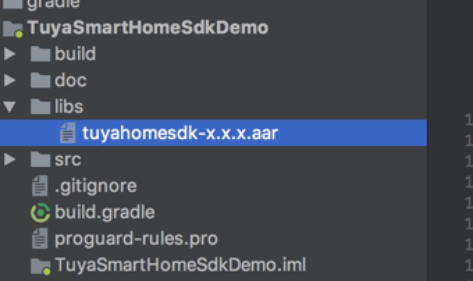

# 集成SDK
## 集成准备
### 一、创建工程

在Android Studio中建立你的工程。

### 二、引入aar包

 

### 三、build.gradle 配置

build.gradle 文件里添加如下配置

```groovy
defaultConfig {
    ndk {
        abiFilters "armeabi-v7a", "x86"
    }

    gradle
    repositories {
        flatDir {
            dirs 'libs'
        }
    }
    dependencies {

        compile 'com.alibaba:fastjson:1.1.67.android'
        compile 'com.squareup.okhttp3:okhttp-urlconnection:3.6.0'

// compile 'de.greenrobot:eventbus:2.4.0'  Deprecated in 2.7.2

        compile 'io.reactivex.rxjava2:rxandroid:2.0.1'
        compile 'io.reactivex.rxjava2:rxjava:2.1.7'
        compile 'org.eclipse.paho:org.eclipse.paho.client.mqttv3:1.2.0'
// compile 'org.eclipse.paho:org.eclipse.paho.android.service:1.1.1' Deprecated in 2.7.2
        compile(name: 'tuyasmart-x.x.x', ext: 'aar')
    }


    android {
        lintOptions {
            abortOnError false
            disable 'InvalidPackage'
        }

        compileOptions {
            sourceCompatibility JavaVersion.VERSION_1_7
            targetCompatibility JavaVersion.VERSION_1_7
        }
        packagingOptions {
            exclude 'META-INF/LICENSE.txt'
            exclude 'META-INF/NOTICE'
            exclude 'META-INF/LICENSE'
            exclude 'META-INF/NOTICE.txt'
            exclude 'META-INF/INDEX.LIST'
            exclude 'META-INF/services/javax.annotation.processing.Processor'
        }
    }
```

> 【注意事项】
>涂鸦智能sdk默认只支持armeabi-v7a和x86架构的平台，如有其他平台需要可前往[GitHub](https://github.com/TuyaInc/tuyasmart_android_sdk/tree/master/library)获取

### 四、AndroidManifest.xml 设置

在AndroidManifest.xml文件里配置appkey和appSecret，在配置相应的权限等

```xml
<meta-data
android:name="TUYA_SMART_APPKEY"
android:value="应用id" />
<meta-data
android:name="TUYA_SMART_SECRET"
android:value="应用密钥" />

添加必要的权限支持
<!-- sdcard -->
<uses-permission android:name="android.permission.WRITE_EXTERNAL_STORAGE" />
<uses-permission android:name="android.permission.READ_EXTERNAL_STORAGE" />
<uses-permission android:name="android.permission.READ_PHONE_STATE" android:required="false"/>
<!-- 网络 -->
<uses-permission android:name="android.permission.INTERNET" />
<uses-permission android:name="android.permission.CHANGE_NETWORK_STATE" />
<uses-permission android:name="android.permission.CHANGE_WIFI_STATE" />
<uses-permission android:name="android.permission.ACCESS_NETWORK_STATE" />
<uses-permission android:name="android.permission.ACCESS_WIFI_STATE" />
<uses-permission android:name="android.permission.WAKE_LOCK"android:required="false" />
<!-- added from 2.7.2 -->
  <uses-permission android:name="android.permission.CHANGE_WIFI_MULTICAST_STATE" android:required="false"/>


添加必要的service和receiver
//<service android:name="org.eclipse.paho.android.service.MqttService" />
//from 2.6.3 com.tuya.smart.mqtt.MqttService replace the org.eclipse.paho.android.service.mqttservice
    <service android:name="com.tuya.smart.mqtt.MqttService" android:stopWithTask="true"/>

<receiver android:name="com.tuya.smart.android.base.broadcast.NetworkBroadcastReceiver">
<intent-filter>
<action android:name="android.net.conn.CONNECTIVITY_CHANGE" />
</intent-filter>
</receiver>

<service
android:name="com.tuya.smart.android.hardware.service.GwBroadcastMonitorService"
android:exported="true"
android:label="UDPService"
android:process=":monitor">
<intent-filter>
<action android:name="tuya.intent.action.udp" />

<category android:name="tuya" />
</intent-filter>
</service>
<service
    android:name="com.tuya.smart.android.hardware.service.DevTransferService"
    android:label="TCPService">
    <intent-filter>
    	<action android:name="tuya.intent.action.tcp" />
           <category android:name="tuya" />
        </intent-filter>
</service>

```

### 五、混淆配置

在proguard-rules.pro文件配置相应混淆配置

```shell
#fastJson
-keep class com.alibaba.fastjson.**{*;}
-dontwarn com.alibaba.fastjson.**

#netty
-keep class io.netty.** { *; }
-dontwarn io.netty.**

#mqtt
-keep class org.eclipse.paho.client.mqttv3.** { *; }
-dontwarn org.eclipse.paho.client.mqttv3.**

-dontwarn okio.**
-dontwarn rx.**
-dontwarn javax.annotation.**
-keep class com.squareup.okhttp.** { *; }
-keep interface com.squareup.okhttp.** { *; }
-keep class okio.** { *; }
-dontwarn com.squareup.okhttp.**

-keep class com.tuya.**{*;}
-dontwarn com.tuya.**
```

## 在代码中使用SDK功能

TuyaHomeSdk 是一切全屋智能API对外的接口，包含：配网、初始化、控制、房间、群组、ZigBee等一系列的操作。
### 一、 Application中初始化涂鸦智能sdk。
**描述**

主要用于初始化通信服务等组件。

**代码范例**

```java
public class TuyaSmartApp extends Application {
    @Override
    public void onCreate() {
        super.onCreate();
        TuyaHomeSdk.init(this);
    }
}
```

>注意事项
>appId和appSecret需要配置AndroidManifest.xml文件里，或者在build环境里配置，也可以在代码里写入。


### 二、 注销涂鸦智能云连接
在退出应用的时候调用以下接口注销掉。

```java
TuyaHomeSdk.onDestroy();
```

