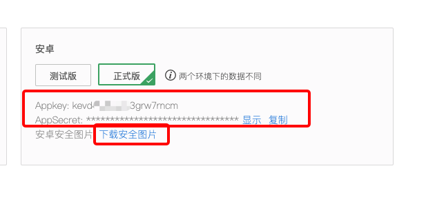
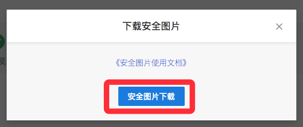

# 集成SDK
### 一、创建工程

在Android Studio中建立你的工程。

### 二、build.gradle 配置

build.gradle 文件里添加集成准备中下载的dependencies 依赖库。

```groovy
defaultConfig {
    ndk {
        abiFilters "armeabi-v7a"
    }
 }
    dependencies {
        implementation 'com.alibaba:fastjson:1.1.67.android'
        implementation 'com.squareup.okhttp3:okhttp-urlconnection:3.6.0'
        implementation 'org.eclipse.paho:org.eclipse.paho.client.mqttv3:1.2.0'
        implementation 'com.tuya.smart:tuyasmart:3.11.0-bata2'
    }
    
repositories {
    mavenLocal()
    jcenter()
    google()
}

```


> 【注意事项】
>
> * 涂鸦智能3.10.0之前的版本的sdk默认只支持armeabi-v7a，如有其他平台需要可前往[GitHub](https://github.com/TuyaInc/tuyasmart_home_android_sdk/tree/master/so_libs)获取。
>
> * 3.10.0版本已经将armeabi-v7a、arm64-v8a、armeabi、x86、x86_64集成进sdk，请将本地手动放入的sdk的相关so库移除，使用sdk中提供的。

### 三、集成安全图片

点击"下载安全图片" ——"安全图片下载" 下载安全图片。





在集成准备中点击“下载安全图片”。将下载的安全图片命名为“t_s.bmp”，放置到工程目录的assets/文件夹下。


### 四、AndroidManifest.xml 设置Appkey和AppSecret

在AndroidManifest.xml文件里配置appkey和appSecret，在配置相应的权限等

```xml
<meta-data
android:name="TUYA_SMART_APPKEY"
android:value="应用Appkey" />
<meta-data
android:name="TUYA_SMART_SECRET"
android:value="应用密钥AppSecret" />

```

### 五、混淆配置

在proguard-rules.pro文件配置相应混淆配置

```bash
#fastJson
-keep class com.alibaba.fastjson.**{*;}
-dontwarn com.alibaba.fastjson.**

#mqtt
-keep class org.eclipse.paho.client.mqttv3.** { *; }
-dontwarn org.eclipse.paho.client.mqttv3.**

-keep class com.squareup.okhttp.** { *; }
-keep interface com.squareup.okhttp.** { *; }
-dontwarn com.squareup.okhttp.**

-keep class okio.** { *; }
-dontwarn okio.**

-keep class com.tuya.**{*;}
-dontwarn com.tuya.**
```

## 在代码中使用SDK功能

TuyaHomeSdk 是一切全屋智能API对外的接口，包含：配网、初始化、控制、房间、群组、ZigBee等一系列的操作。
### 一、 Application中初始化涂鸦智能sdk。
**描述**

主要用于初始化通信服务等组件。

**代码范例**

```java
public class TuyaSmartApp extends Application {
    @Override
    public void onCreate() {
        super.onCreate();
        TuyaHomeSdk.init(this);
    }
}
```

>注意事项
>appId和appSecret需要配置AndroidManifest.xml文件里，或者在build环境里配置，也可以在代码里写入。


### 二、 注销涂鸦智能云连接
在退出应用的时候调用以下接口注销掉。

```java
TuyaHomeSdk.onDestroy();
```

### 三、debug开关

在debug模式下可以开启sdk的日志开关，查看更多的日志信息，帮助快速定位问题。在release模式下建议关闭日志开关。

```java
TuyaHomeSdk.setDebugMode(true);
```