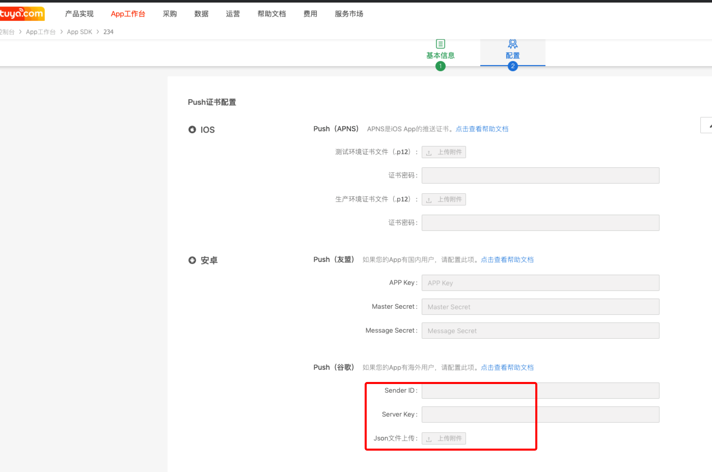
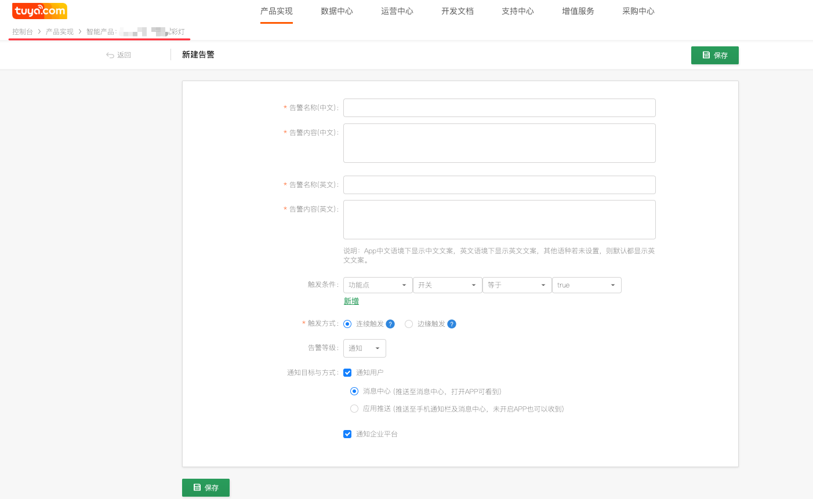

## 集成 FCM Push

对于国外的用户，需要集成 Google 的 FCM 推送服务。先参照官方文档 [将 Firebase 添加到您的 Android 项目](https://firebase.google.com/docs/android/setup?hl=zh-cn),之后配置客户端，参考 [Android 客户端配置 Firebase](https://firebase.google.com/docs/cloud-messaging/android/client?hl=zh-cn)。

## 配置 FCM 信息到 Tuya IOT 平台

请将参照文档 [**FCM注册流程**](https://docs.tuya.com/docDetail?code=K8uhkijtdvosi) 将 Sender ID、Server Key、google-services.json 文件配置到 iot 平台的“ App 工作台”-“APP SDK”  对应应用的配置的 "Push（谷歌）"中。

> [warning] 注意事项
>
> 请复制内容填写到对应的输入框中，不要配置错误，或者将 Sender ID、Server Key 配置反了




## 将注册令牌注册到涂鸦云

在继承`FirebaseInstanceIdService`类的`onTokenRefresh`方法监控注册令牌的生成，并将令牌注册到涂鸦云。

```java
		TuyaHomeSdk.getPushInstance().registerDevice(String token, String pushProvider, new IResultCallback() {
    @Override
    public void onError(String code, String error) {
    }

    @Override
    public void onSuccess() {

    }
});
```

**参数说明**

| 参数         | 说明                           |
| ------------ | ------------------------------ |
| token        | fcm 生成的 token               |
| pushProvider | 注册 push 的类别  fcm 填 "fcm" |

## 接收处理消息

在继承 FirebaseMessagingService  的类中的 onMessageReceived 方法中接收处理消息

```java
public class MyFcmListenerService extends FirebaseMessagingService {
    public static final String TAG = "MyFcmListenerService";
    public static HashMap<String, Long> pushTimeMap = new HashMap<>();

    @Override
    public void onMessageReceived(RemoteMessage message) {
        Log.d(TAG, "FCM message received" + message.getData().toString());
  
    }
}
```

> message.getData() 中的内容就是收到的推送信息

## 用户解绑

在用户退出登录等需要解除应用和用户关系的操作下调用 FCM 的移除注册令牌的方法

```java
FirebaseInstanceId.getInstance().deleteInstanceId();
```

## 发送 Push

### 新增运营 Push

涂鸦开发者平台 - 用户运营 - 消息中心 - 新增消息


### 新增告警 Push

涂鸦开发者平台 - 对应产品 - 扩展功能 - 告警设置 - 新增告警规则(应用推送方式)



## 注意事项

* 使用 FCM ,需要手机有安装 Google 服务，并且可以正常连接 Google。